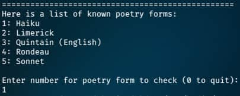

<div align = "center">

<h1><a href="https://2kabhishek.github.io/poetry-checker">Poetry Checker</a></h1>

<a href="https://github.com/2KAbhishek/poetry-checker/blob/main/LICENSE">
 </a>

<a href="https://github.com/2KAbhishek/poetry-checker/graphs/contributors">
 </a>

<a href="https://github.com/2KAbhishek/poetry-checker/stargazers">
</a>

<a href="https://github.com/2KAbhishek/poetry-checker/network/members">
 </a>

<a href="https://github.com/2KAbhishek/poetry-checker/watchers">
 </a>

<a href="https://github.com/2KAbhishek/poetry-checker/pulse">
 </a>

<h3>Analyze your poetry ✍🏻📃</h3>

<figure>
  
  <br/>
  <figcaption>poetry-checker screenshot</figcaption>
</figure>

</div>

## What is this

A poetry checking tool that analyzes poems and tells you information about them.
Can tell you different types of poetry based on dictionary and rhyming.

## Inspiration

Always enjoyed poetry, read about dictionaries and rhyming, implemented this.

## Prerequisites

Before you begin, ensure you have met the following requirements:

- You have installed the latest version of `python`

## Getting poetry-checker

To install poetry-checker, follow these steps:

```bash
git clone https://github.com/2kabhishek/poetry-checker
cd poetry-checker
```

## Using poetry-checker

To run poetry-checker, follow these steps: `python src/poetry_program.py`

By default it looks at the [sample_poems](./data/sample_poems/) directory, add your poem to the directory and run the program.
Enter the file name when prompted.

## Tests

Every module has it's own doctest, which can be run by running `python -m doctest -v <module>`.
Unit tests can be ran using `python -m unittest`.

Custom linter is present in the `util` directory.

## How it was built

poetry-checker was built using `python`

## Challenges faced

Setting up tests was tricky, due to module path issues.

## What I learned

- Learned about `doctest` and found it very useful for documentation.
- Pronunciation and they are used in rhyming.
- Different types of poetry.

## What's next

Add CLI flags to pass in poems.txt file.

Hit the ⭐ button if you found this useful.

## More Info

<div align="center">

<a href="https://github.com/2KAbhishek/poetry-checker">Source</a> | <a href="https://2kabhishek.github.io/poetry-checker">Website</a>

</div>
